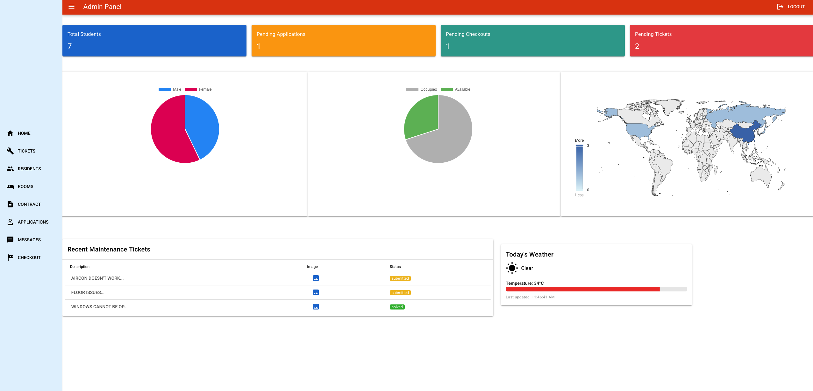
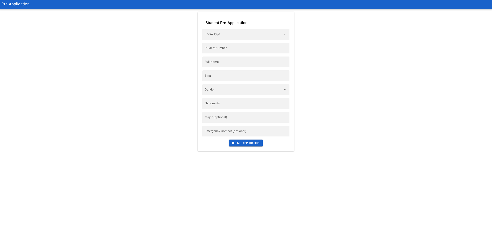
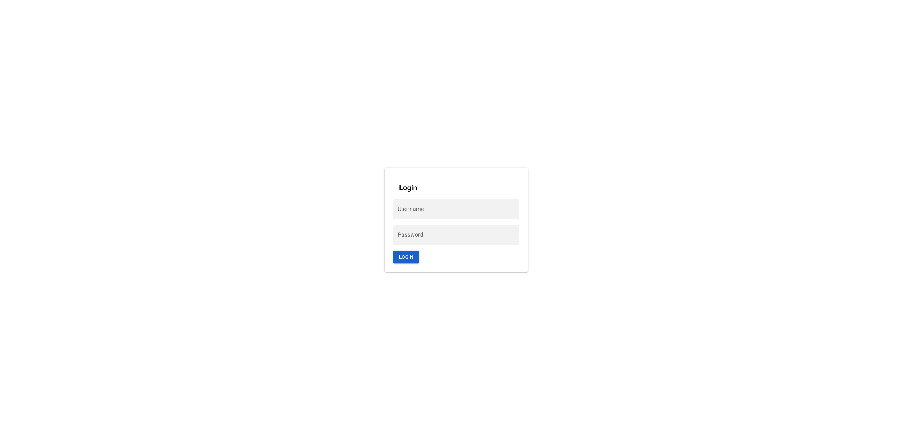
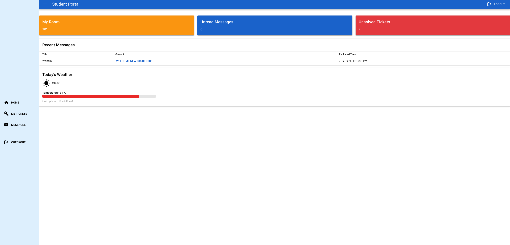
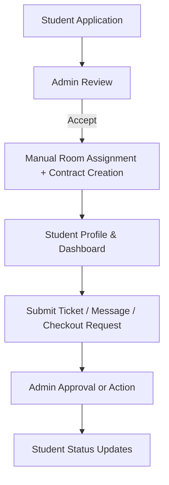
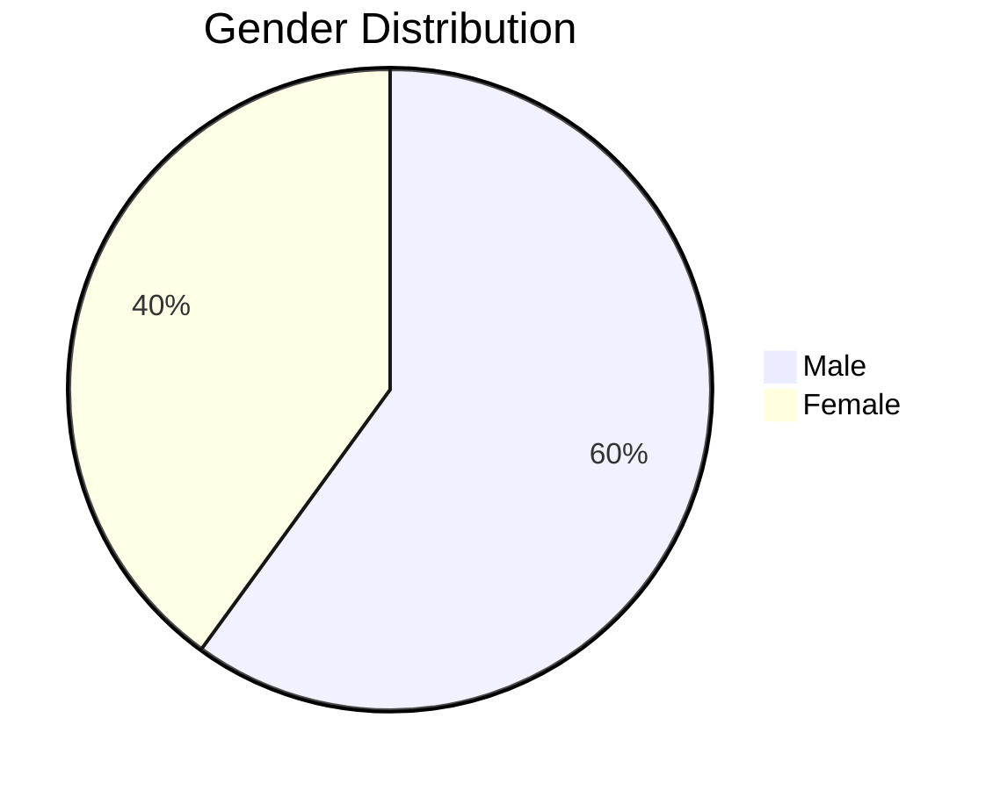
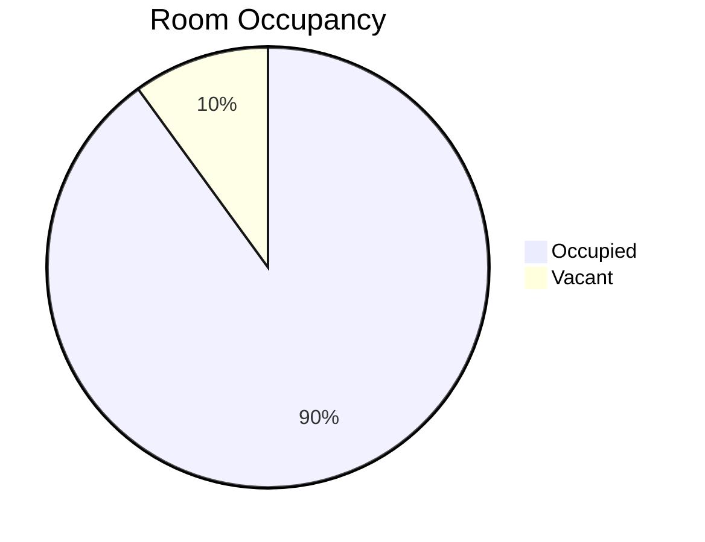

<p align="right">
  <a href="assets/README.ja.md">
    
  </a>
  <a href="assets/README.zh.md">
    
  </a>
</p>
# 🏢 Dormitory Management System

A full-stack web application for managing student dormitory operations including applications, room assignments, contracts, maintenance tickets, checkouts, and messaging. Designed for real-world workflows and admin/student roles.

---

## 🌐 Live Demo

> 🚀 Visit: [dorm.oeyoungisthegod.tk](https://dorm.oeyoungisthegod.tk/admin) (custom domain via Cloudflare + Amazon Lightsail, you can try with username admin1234@dorm.jp and password 123456)

---

## 🚨 This is the front end repo, you can navigate to [backend](https://github.com/yangyang03-dev/dormitory_management_backend) to look up for backend stuff

## 📸 Screenshots


Admin Dashboard
- 
Pre-application page
- 
Login page 
- 
Student Homepage
- 

**Feel free to view more screenshots at /assets**
---

## 🧠 System Overview



---

## ⚙️ Tech Stack

### 🌍 Frontend
- **Vue 3** + **Quasar Framework**
- **Axios** for API communication
- **ECharts** for visualizations (pie charts, room stats)
- **Leaflet** for interactive nationality world map
- **QTable** with slot customization
- **Responsive Design** via Quasar CSS utilities

### 🔙 Backend
- **Java 21**, **Spring Boot 3**
- **Maven** project structure
- **Spring Security** (Role-based access: Admin, Student)
- **RESTful API Design**
- **PostgreSQL** as primary database
- **File Upload Support** (ticket image upload via multipart)

### 🛠 Deployment
- **Amazon Lightsail VPS**
- **Nginx** as reverse proxy
- **Cloudflare** for DNS and SSL
- **Manual `scp` Deployment via GitHub Actions**
- **Domain Binding** with SSL/TLS setup

---

## 📁 Core Features

### 👨‍🎓 Student Side
- 📝 Apply to dorms
- 📄 View contract, room number, and status
- 🛠 Submit maintenance tickets (with image upload)
- ✉️ Receive messages from admins
- 📤 Request checkout with reason and preferred date

### 🧑‍💼 Admin Side
- 📋 Review student applications with dialog + status actions
- 🏠 Assign room numbers manually & auto-update room availability
- 📑 View all student data grouped by status
- 🧾 Manage contracts, check-ins, and checkouts
- 🛠 Handle and mark maintenance tickets as solved
- 📢 Publish announcements/messages
- 📊 View gender distribution, nationality map, and room occupancy stats
- 🌦 Live weather card (via 3rd-party weather API)

---

## 🖼 Sample Charts





---

## 📂 Project Structure

```
├── backend/
│   ├── src/main/java/...
│   └── application.properties
├── frontend/ (quasar-project)
│   ├── src/pages/admin/
│   ├── src/pages/student/
│   ├── src/pages/common/
│   ├── dist/spa/ (build output)
│   └── quasar.conf.js
└── README.md
```

---

## 🔐 Auth Flow

- JWT Token used for secure role-based sessions
- Stored in browser; validated on each API request
- Spring Security filters requests by endpoint prefix (`/api/admin/**`, `/api/student/**`)

---

## 📦 Build & Deploy

### 🔨 Build frontend

```bash
cd quasar-project
quasar build
```

### 📤 Deploy to Server via SCP

```bash
scp -i ~/.ssh/your-key.pem -r dist/spa/* ubuntu@your-ip:/var/www/html/
```

### ⚙️ Configure Nginx

```nginx
server {
    listen 80;
    server_name yourdomain.com;

    root /var/www/html;
    index index.html;

    location / {
        try_files $uri $uri/ /index.html;
    }
}
```

---

## 📈 Future Improvements

- Features of rent payment(including real payment API connections)
- Chinese and Japanese language localization (i18n)
- Dark mode toggle
- CI/CD more advanced implmentation
- Use multiple servers to host the Springboot app; use K8S and Docker to manage them

---

## 👨‍💻 Author

**Yang Yang**  
Graduate Student at UTokyo | Web Developer 
🇯🇵 Currently in Chiba, Japan

---

## 📜 License

This project is licensed under the MIT License.
