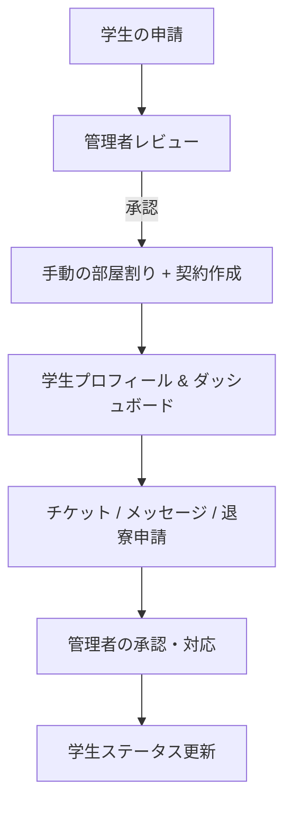
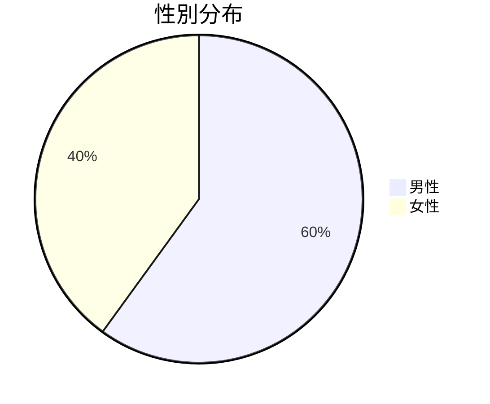
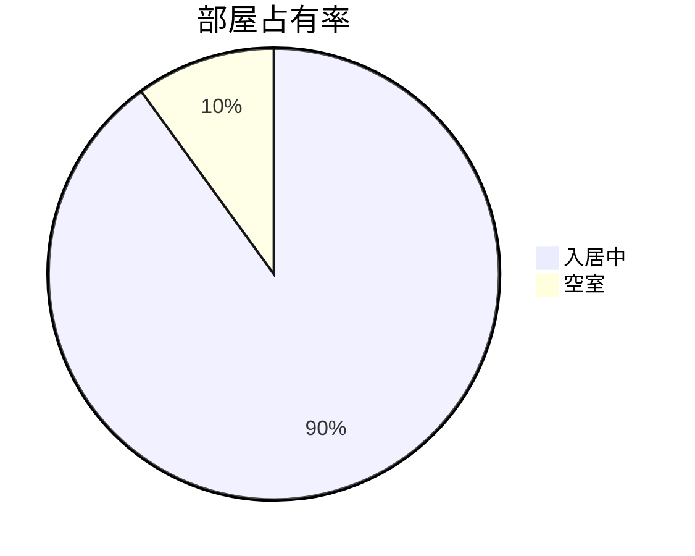

# 🏢 寮管理システム

学生寮の申請、部屋割り、契約、メンテナンスチケット、退寮手続き、メッセージ機能を一元管理するフルスタック Web アプリケーション。実運用のワークフローと管理者／学生ロールに合わせて設計しています。

---

## 🌐 デモサイト

> 🚀 アクセス: [dorm.oeyoungisthegod.tk](https://dorm.oeyoungisthegod.tk/admin)  
> （Cloudflare + Amazon Lightsail による独自ドメイン運用。ユーザー名 **admin1234@dorm.jp**、パスワード **123456** でお試しください）

---

## 🚨 これはフロントエンドのリポジトリです。バックエンドは[こちら](https://github.com/yangyang03-dev/dormitory_management_backend)をご覧ください

## 📸 スクリーンショット

管理ダッシュボード  
-   
プレ申請ページ  
-   
ログインページ  
-   
学生ホームページ  
- 

**このフォルダ（/assets）に他のスクリーンショットもあります**

---

## 🧠 システム概要




---

## ⚙️ 技術スタック

### 🌍 フロントエンド
- **Vue 3** + **Quasar Framework**
- **Axios**（API 通信）
- **ECharts**（可視化：円グラフ、部屋統計）
- **Leaflet**（国籍のインタラクティブ世界地図）
- **QTable**（スロットカスタマイズ）
- **レスポンシブデザイン**（Quasar のユーティリティ）

### 🔙 バックエンド
- **Java 21**, **Spring Boot 3**
- **Maven** プロジェクト構成
- **Spring Security**（ロールベース認可：Admin / Student）
- **RESTful API 設計**
- **PostgreSQL**（メイン DB）
- **ファイルアップロード対応**（チケット画像の multipart 送信）

### 🛠 デプロイ
- **Amazon Lightsail VPS**
- **Nginx**（リバースプロキシ）
- **Cloudflare**（DNS と SSL）
- **GitHub Actions からの手動 `scp` デプロイ**
- **独自ドメインのバインド**（SSL/TLS 設定）

---

## 📁 コア機能

### 👨‍🎓 学生側
- 📝 寮への申請
- 📄 契約・部屋番号・ステータスの確認
- 🛠 メンテナンスチケットの提出（画像アップロード対応）
- ✉️ 管理者からのメッセージ受信
- 📤 退寮申請（理由・希望日を入力）

### 🧑‍💼 管理者側
- 📋 学生申請のレビュー（ダイアログ＋ステータス操作）
- 🏠 手動での部屋割り & 空室状況の自動更新
- 📑 ステータス別の学生データ一覧
- 🧾 契約・チェックイン・チェックアウトの管理
- 🛠 メンテナンスチケットの対応・解決
- 📢 お知らせ／メッセージの配信
- 📊 性別分布、国籍マップ、部屋占有率の可視化
- 🌦 天気カード（外部 API 利用）

---

## 🖼 サンプルチャート





---

## 📂 プロジェクト構成

```
├── backend/
│   ├── src/main/java/...
│   └── application.properties
├── frontend/ (quasar-project)
│   ├── src/pages/admin/
│   ├── src/pages/student/
│   ├── src/pages/common/
│   ├── dist/spa/ (ビルド成果物)
│   └── quasar.conf.js
└── README.md
```

---

## 🔐 認証フロー

- JWT トークンによるロールベースのセッション
- ブラウザに保存し、各 API リクエストで検証
- Spring Security によるエンドポイントのプレフィックス別フィルタ（`/api/admin/**`, `/api/student/**`）

---

## 📦 ビルド & デプロイ

### 🔨 フロントエンドのビルド
```bash
cd quasar-project
quasar build
```

### 📤 SCP でサーバへデプロイ

```bash
scp -i ~/.ssh/your-key.pem -r dist/spa/* ubuntu@your-ip:/var/www/html/
```

### ⚙️ Nginx 設定

```nginx
server {
    listen 80;
    server_name yourdomain.com;

    root /var/www/html;
    index index.html;

    location / {
        try_files $uri $uri/ /index.html;
    }
}
```

---

## 📈 今後の改善

- 家賃支払い機能（実決済 API 連携）
- 中国語・日本語のローカリゼーション（i18n）
- ダークモード切り替え
- さらに高度な CI/CD
- Spring Boot 複数インスタンス運用、K8s + Docker による管理

---

## 👨‍💻 著者

**Yang Yang**  
東京大学 大学院生 | Web Developer  
🇯🇵 現在：千葉在住

---

## 📜 ライセンス

本プロジェクトは MIT ライセンスの下で提供されます。
