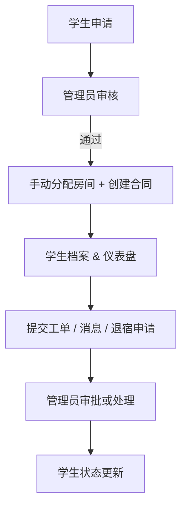
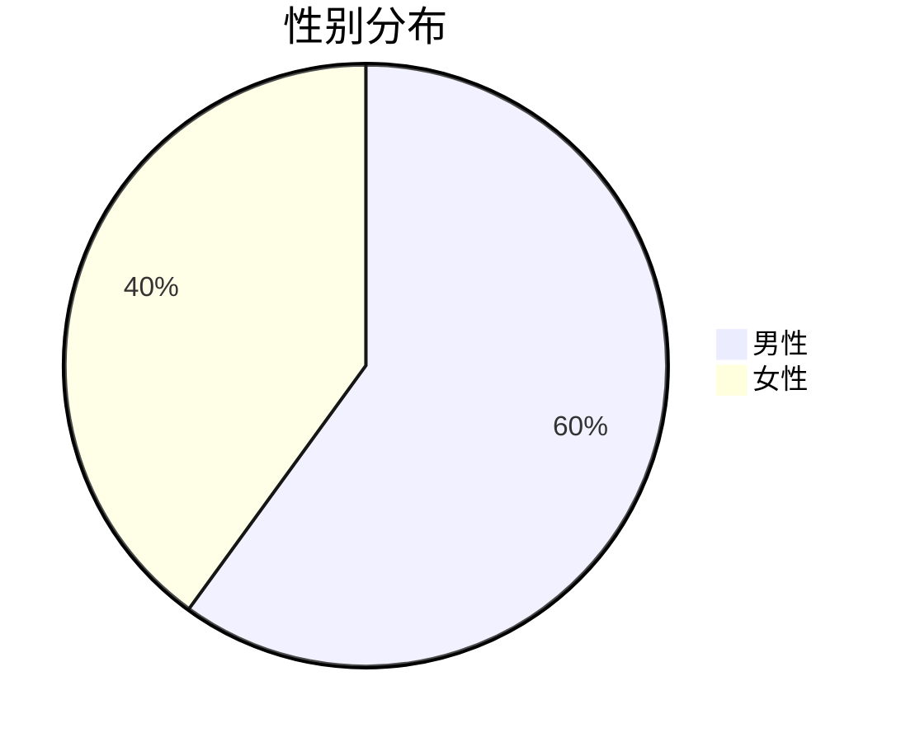
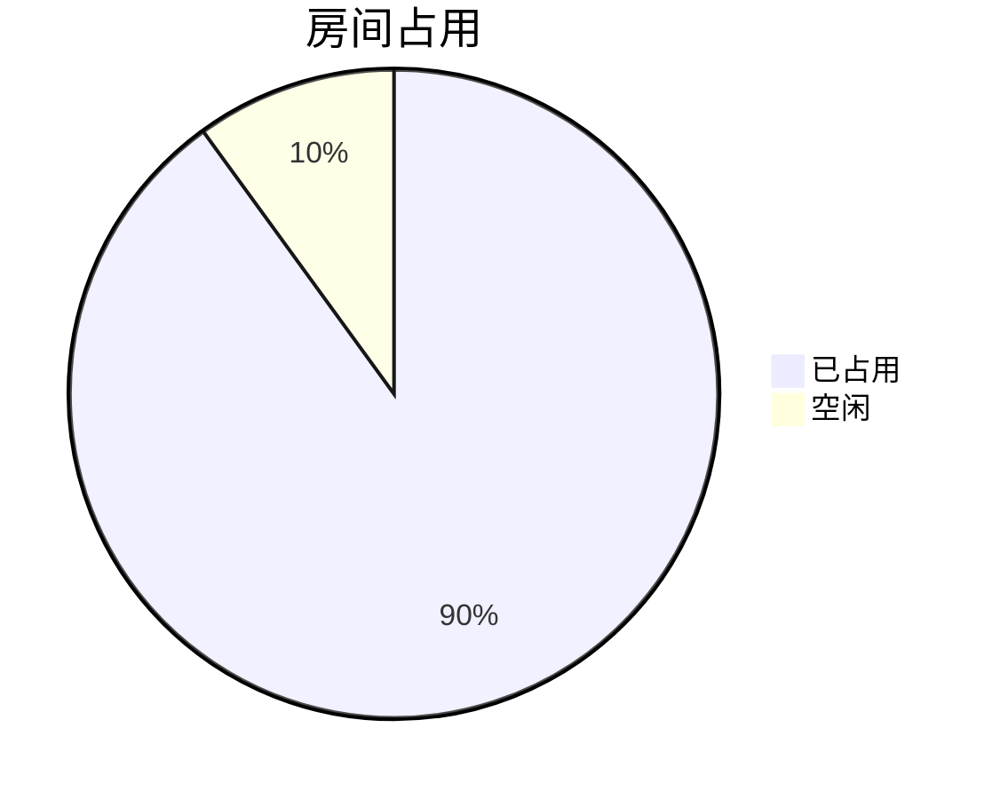

# 🏢 宿舍管理系统

一个用于管理学生宿舍运营的全栈 Web 应用，覆盖申请、房间分配、合同、维修工单、退宿与站内消息。围绕真实业务流程设计，支持管理员/学生两种角色。

---

## 🌐 在线演示

> 🚀 访问: [dorm.oeyoungisthegod.tk](https://dorm.oeyoungisthegod.tk/admin)  
> （Cloudflare + Amazon Lightsail 自定义域名；可使用 **admin1234@dorm.jp / 123456** 体验）

---

## 🚨 这是前端仓库，后端请前往 [backend](https://github.com/yangyang03-dev/dormitory_management_backend)

## 📸 截图

管理员仪表盘  
-   
预申请页面  
-   
登录页  
-   
学生首页  
- 

**更多截图见本目录（/assets）**

---

## 🧠 系统概览



---

## ⚙️ 技术栈

### 🌍 前端
- **Vue 3** + **Quasar Framework**
- **Axios**（API 通信）
- **ECharts**（可视化：饼图、房间统计）
- **Leaflet**（国籍互动世界地图）
- **QTable**（插槽自定义）
- **响应式设计**（基于 Quasar CSS 工具类）

### 🔙 后端
- **Java 21**, **Spring Boot 3**
- **Maven** 项目结构
- **Spring Security**（基于角色的访问控制：Admin/Student）
- **RESTful API 设计**
- **PostgreSQL** 主数据库
- **文件上传支持**（工单图片 multipart 上传）

### 🛠 部署
- **Amazon Lightsail VPS**
- **Nginx** 反向代理
- **Cloudflare** DNS 与 SSL
- **通过 GitHub Actions 手动 `scp` 部署**
- **域名绑定** 与 SSL/TLS 配置

---

## 📁 核心功能

### 👨‍🎓 学生端
- 📝 提交宿舍申请
- 📄 查看合同、房间号与状态
- 🛠 提交维修工单（支持图片上传）
- ✉️ 接收管理员消息
- 📤 提交退宿申请（填写原因与期望日期）

### 🧑‍💼 管理端
- 📋 审核学生申请（弹窗 + 状态操作）
- 🏠 手动分配房间并自动更新空置状态
- 📑 按状态查看所有学生数据
- 🧾 管理合同、入住与退宿
- 🛠 处理并标记维修工单为已解决
- 📢 发布公告/消息
- 📊 查看性别分布、国籍地图、房间占用统计
- 🌦 实时天气卡片（第三方天气 API）

---

## 🖼 示例图表





---

## 📂 项目结构

```
├── backend/
│   ├── src/main/java/...
│   └── application.properties
├── frontend/ (quasar-project)
│   ├── src/pages/admin/
│   ├── src/pages/student/
│   ├── src/pages/common/
│   ├── dist/spa/ (构建产物)
│   └── quasar.conf.js
└── README.md
```

---

## 🔐 认证流程

- 使用 JWT Token 进行基于角色的安全会话
- 保存在浏览器端；每次 API 请求都会校验
- Spring Security 按路径前缀过滤请求（`/api/admin/**`, `/api/student/**`）

---

## 📦 构建与部署

### 🔨 构建前端

```bash
cd quasar-project
quasar build
```

### 📤 通过 SCP 部署到服务器

```bash
scp -i ~/.ssh/your-key.pem -r dist/spa/* ubuntu@your-ip:/var/www/html/
```

### ⚙️ 配置 Nginx

```nginx
server {
    listen 80;
    server_name yourdomain.com;

    root /var/www/html;
    index index.html;

    location / {
        try_files $uri $uri/ /index.html;
    }
}
```

---

## 📈 后续计划

- 房租支付功能（接入真实支付 API）
- 中文与日文本地化（i18n）
- 深色模式切换
- 更完善的 CI/CD
- Spring Boot 多实例部署；使用 K8s + Docker 编排管理

---

## 👨‍💻 作者

**杨 杨 YANG YANG**  
东京大学修士 | Web 开发者  
🇯🇵 现居日本千叶

---

## 📜 许可证

本项目基于 MIT License 开源。
